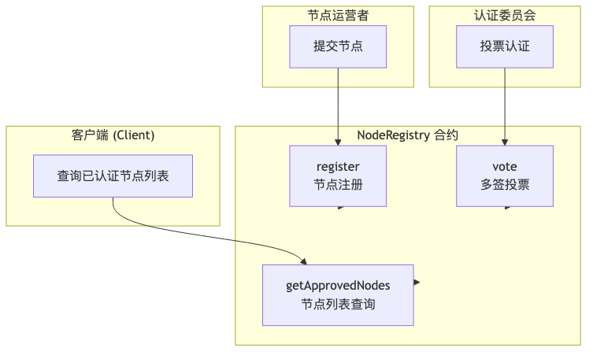
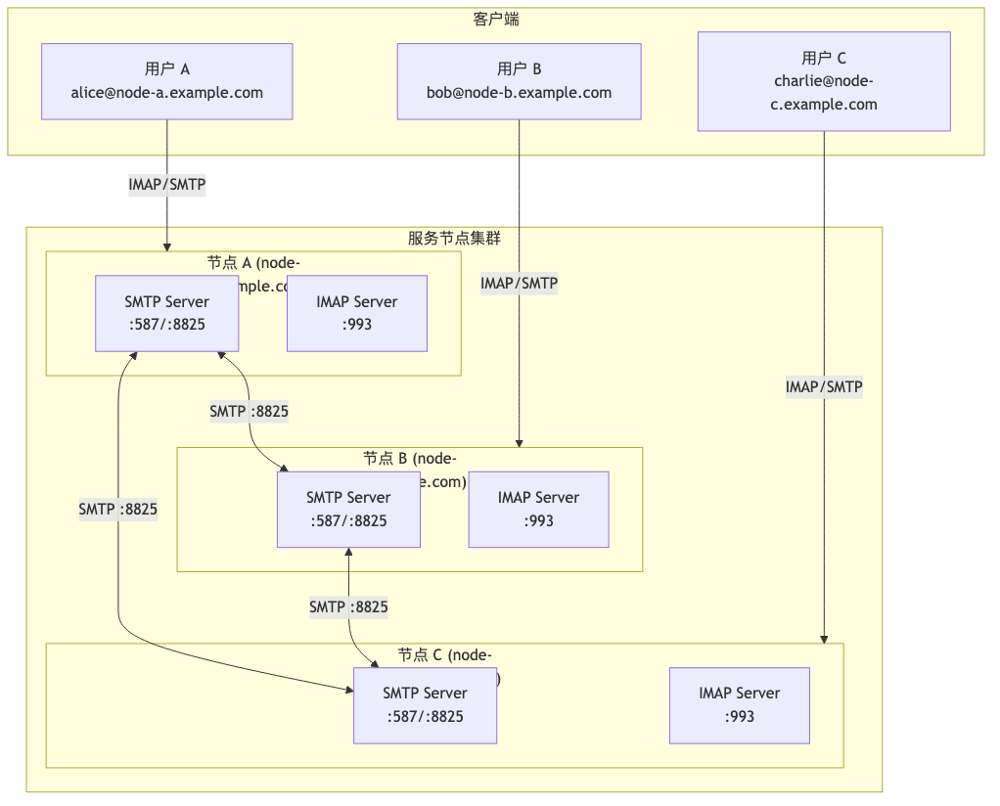
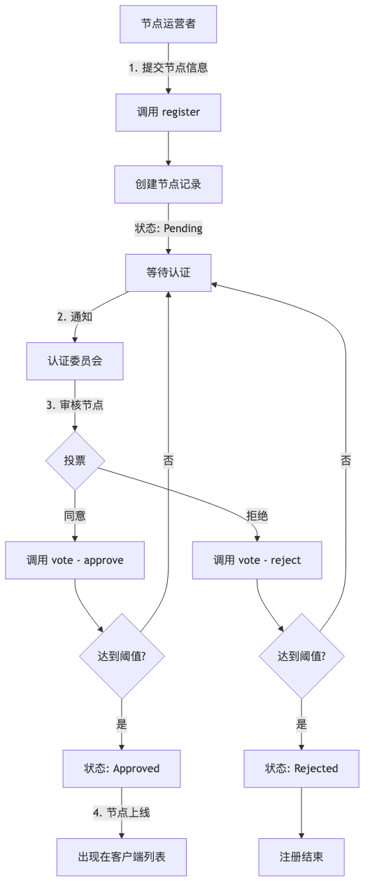
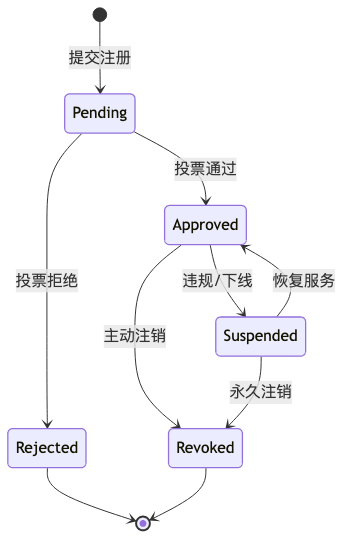
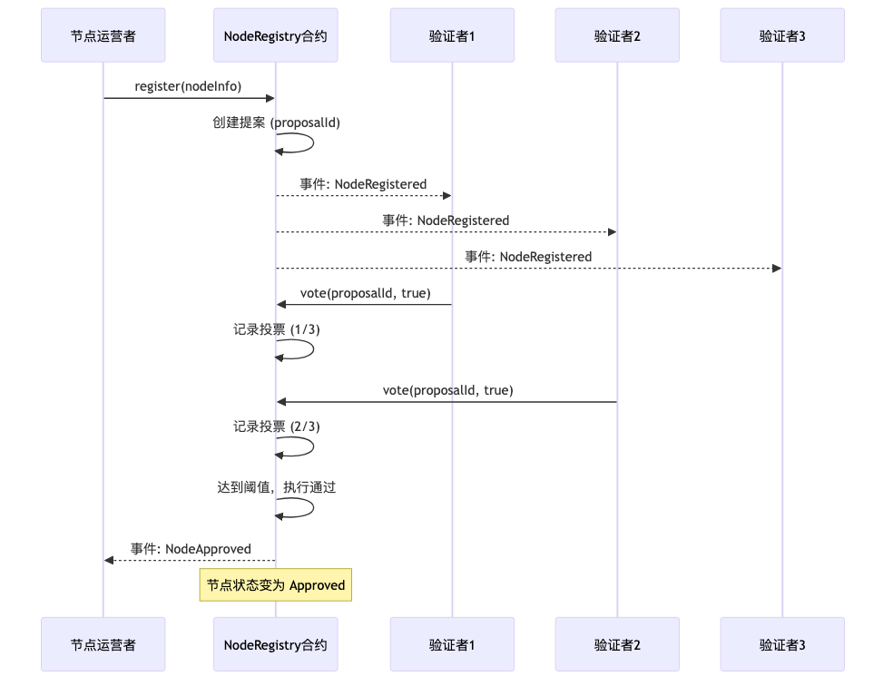

# 服务节点注册合约方案

## 概述

本方案设计一个去中心化的服务节点注册与认证系统，通过智能合约实现节点信息的链上提交、多签投票认证，以及认证节点列表的管理。

---

## 核心功能

| 功能 | 说明 |
|------|------|
| 节点注册 | 用户提交服务节点信息到链上 |
| 多签认证 | 认证委员会成员对节点进行投票 |
| 状态管理 | 管理节点的待审核、已认证、已撤销等状态 |
| 节点查询 | 客户端获取已认证的服务节点列表 |

---

## 系统架构



---

## 网络部署图



**通信说明：**

| 通信类型 | 协议 | 端口 | 说明 |
|---------|------|------|------|
| 客户端 → 节点 | SMTP | 587 | 邮件发送 (Submission) |
| 客户端 → 节点 | IMAP | 993 | 邮件接收 (TLS) |
| 节点 ↔ 节点 | SMTP | 8825 | 节点间邮件转发 |

---

## 流程图

### 1. 节点注册与认证流程



### 2. 节点状态流转



### 3. 多签投票流程



---

## 数据结构

### 节点信息 (NodeInfo)

```solidity
struct NodeInfo {
    address owner;           // 节点所有者地址
    string  domain;          // 服务域名
    string  endpoint;        // 服务端点 (IP:Port 或 URL)
    uint256 registeredAt;    // 注册时间
    NodeStatus status;       // 节点状态
}
```

### 节点状态 (NodeStatus)

```solidity
enum NodeStatus {
    Pending,    // 待审核
    Approved,   // 已认证
    Rejected,   // 已拒绝
    Suspended,  // 已暂停
    Revoked     // 已注销
}
```

### 投票提案 (Proposal)

```solidity
struct Proposal {
    bytes32 nodeId;          // 节点ID
    uint256 approveCount;    // 同意票数
    uint256 rejectCount;     // 拒绝票数
    uint256 deadline;        // 投票截止时间
    bool    executed;        // 是否已执行
    mapping(address => bool) hasVoted;  // 投票记录
}
```

---

## 合约接口

### 核心方法

```solidity
interface INodeRegistry {
    // ========== 节点管理 ==========

    /// @notice 注册新节点
    /// @param domain 服务域名
    /// @param endpoint 服务端点
    /// @param publicKey 节点公钥
    /// @param region 服务区域
    function register(
        string calldata domain,
        string calldata endpoint,
    ) external returns (bytes32 nodeId);

    /// @notice 更新节点信息
    function updateNode(
        bytes32 nodeId,
        string calldata endpoint,
    ) external;

    /// @notice 注销节点
    function revokeNode(bytes32 nodeId) external;

    // ========== 多签投票 ==========

    /// @notice 对节点注册进行投票
    /// @param nodeId 节点ID
    /// @param approve 是否同意
    function vote(bytes32 nodeId, bool approve) external;

    // ========== 查询接口 ==========

    /// @notice 获取所有已认证节点
    function getApprovedNodes() external view returns (NodeInfo[] memory);

    /// @notice 获取节点详情
    function getNode(bytes32 nodeId) external view returns (NodeInfo memory);

    /// @notice 按区域获取节点
    function getNodesByRegion(string calldata region) external view returns (NodeInfo[] memory);

    // ========== 管理接口 ==========

    /// @notice 添加验证者
    function addValidator(address validator) external;

    /// @notice 移除验证者
    function removeValidator(address validator) external;

    /// @notice 设置投票阈值
    function setThreshold(uint256 threshold) external;
}
```

### 事件

```solidity
// 节点注册事件
event NodeRegistered(bytes32 indexed nodeId, address indexed owner, string domain);

// 节点认证通过事件
event NodeApproved(bytes32 indexed nodeId);

// 节点认证拒绝事件
event NodeRejected(bytes32 indexed nodeId);

// 节点注销事件
event NodeRevoked(bytes32 indexed nodeId);

// 投票事件
event Voted(bytes32 indexed nodeId, address indexed validator, bool approve);

// 验证者变更事件
event ValidatorAdded(address indexed validator);
event ValidatorRemoved(address indexed validator);
```

---

## 参数配置

| 参数 | 默认值 | 说明 |
|------|--------|------|
| VOTE_DURATION | 7 days | 投票持续时间 |
| APPROVAL_THRESHOLD | 2/3 | 通过阈值 (验证者数量的 2/3) |
| MAX_VALIDATORS | 21 | 最大验证者数量 |

---

## 安全考虑

### 1. 多签安全
- 采用 2/3 多数通过机制
- 验证者不能重复投票
- 投票有时间限制

### 2. 权限控制
- 只有节点所有者可更新/注销节点
- 只有验证者可参与投票
- 验证者管理需多签确认

### 3. 防攻击措施
- 域名唯一性检查，防止冒充
- 端点格式验证
- 注册频率限制

---

## 客户端集成

### 获取节点列表

```go
// 调用合约获取已认证节点
nodes, err := contract.GetApprovedNodes(nil)
if err != nil {
    return err
}

// 按区域筛选
for _, node := range nodes {
    if node.Region == preferredRegion {
        // 添加到本地服务器列表
    }
}
```

### 监听节点变更

```go
// 监听节点认证事件
events := make(chan *NodeApproved)
sub, err := contract.WatchNodeApproved(nil, events)

go func() {
    for event := range events {
        // 更新本地节点列表
        updateLocalNodeList(event.NodeId)
    }
}()
```

---

## 部署计划

### 阶段一：测试网部署
1. 部署合约到测试网
2. 初始化验证者委员会
3. 测试注册和投票流程

### 阶段二：主网部署
1. 安全审计
2. 部署到主网
3. 迁移验证者

### 阶段三：客户端集成
1. 客户端集成合约调用
2. 实现节点列表同步
3. 用户界面展示

---

## 扩展功能

### 未来可扩展
- **信誉系统**: 根据节点服务质量计算信誉分
- **自动监控**: 链下 Oracle 监控节点可用性
- **奖励机制**: 优质节点获得奖励
- **分层认证**: 不同级别的节点认证

---

## 总结

本方案通过智能合约实现了去中心化的服务节点注册与认证系统：

1. **去中心化注册**: 任何人都可以提交节点
2. **多签认证**: 委员会投票确保节点质量
3. **链上透明**: 所有操作链上可查
4. **客户端友好**: 提供简洁的查询接口

通过这套机制，确保了服务节点的可信度，同时保持了系统的开放性和去中心化特性。
